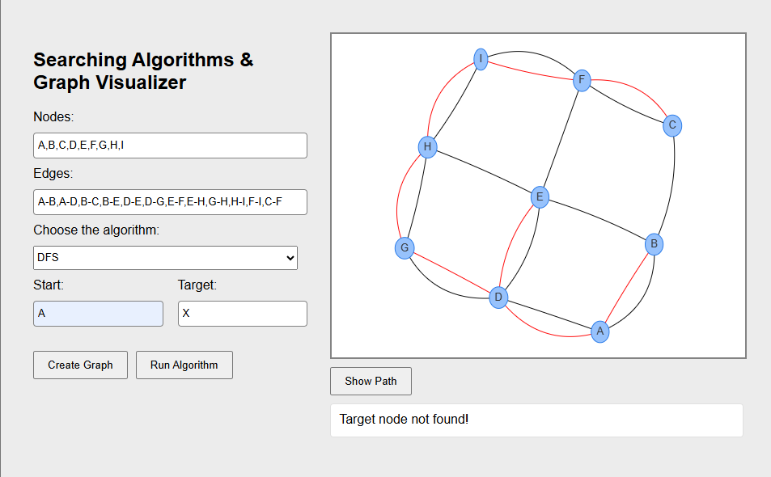

# 🧠 GraphTraversal Visualizer
(Interactive BFS/DFS Algorithm Explorer)

A visual tool demonstrating graph traversal algorithms in action.
This web application helps users understand **Breadth-First Search (BFS)** and **Depth-First Search (DFS)** algorithms through interactive visualizations. Create **custom graphs** and watch the algorithms explore nodes in real-time with step-by-step animations.

**🎥 [Watch the demo on YouTube](https://youtu.be/R6lZsiIgHLw)**
</br></br>

</br>

# 🚀 Technologies Used
- Python (`Flask` backend)
- JavaScript
- NetworkX (Graph processing)
- HTML5/CSS3 (Responsive UI)

</br>

# 📦 Getting Started

Follow the steps below to run the project locally:

## 1. Clone the repository
```bash
git clone https://github.com/mazen-alasas/GraphTraversal-Visualizer.git
cd GraphTraversal-Visualizer
```
## 2. Create a virtual environment
```bash
python -m venv venv
```
## 3. Activate the virtual environment
#### On Windows CMD:
```bash
venv\Scripts\activate
```
#### On Windows PowerShell:
```bash
.\venv\Scripts\Activate.ps1
```
## 4. Install dependencies
```bash
pip install -r requirements.txt
```
## 5. Run the simulation
```bash
python run.py
```
**Note**: Make sure you're running the command from the root directory where `run.py` is located.


## 🗂️ Project Structure

```
graph-visualizer/
├── app/
│   ├── 📂 algorithms/
│   │   ├── __init__.py
│   │   ├── bfs.py
│   │   └── dfs.py
│   ├── 📂 static/
│   │   ├── 📂 css/
│   │   │   └── style.css
│   │   └── 📂 js/
│   │       └── script.js
│   ├── __init__.py
│   └── routes.py
├── 📂 templates/
│   └── index.html
├── README.md
├── data.txt
├── requirements.txt
└── run.py
```

</br>

# 👨‍💻 Collaborators 
<table>
  <tr>
    <td align="center">
      <a href="https://github.com/mazen-alasas">
        <br>
        <sub><a href="https://www.linkedin.com/in/mazen-ahmed-alasas-772831244/">Mazen Alasas</a></sub>
      </a>
    </td>
    <td align="center">
      <a href="https://github.com/AhmedMohIsmail">
        <br>
        <sub><a href="https://www.linkedin.com/in/ahmed-ismail-00b03b2ba/">Ahmed Ismail</a></sub>
      </a>
    </td>
  </tr>
</table>

</br>

# 💡 Project Goal
To create an intuitive educational tool that makes abstract graph algorithms tangible through visualization, helping students and developers grasp traversal concepts faster.

## Contact
Feel free to reach out!

[](https://www.linkedin.com/in/mazen-ahmed-alasas-772831244/)
[](https://www.youtube.com/@mazen_labs)